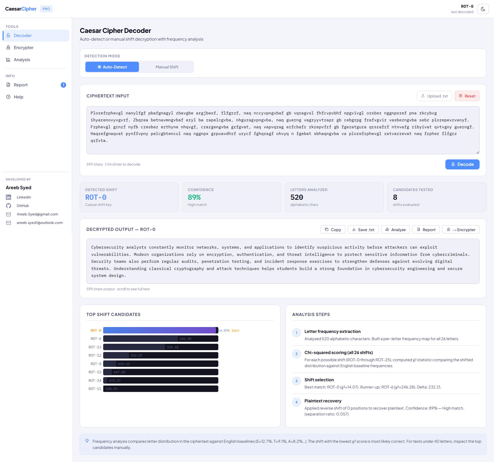
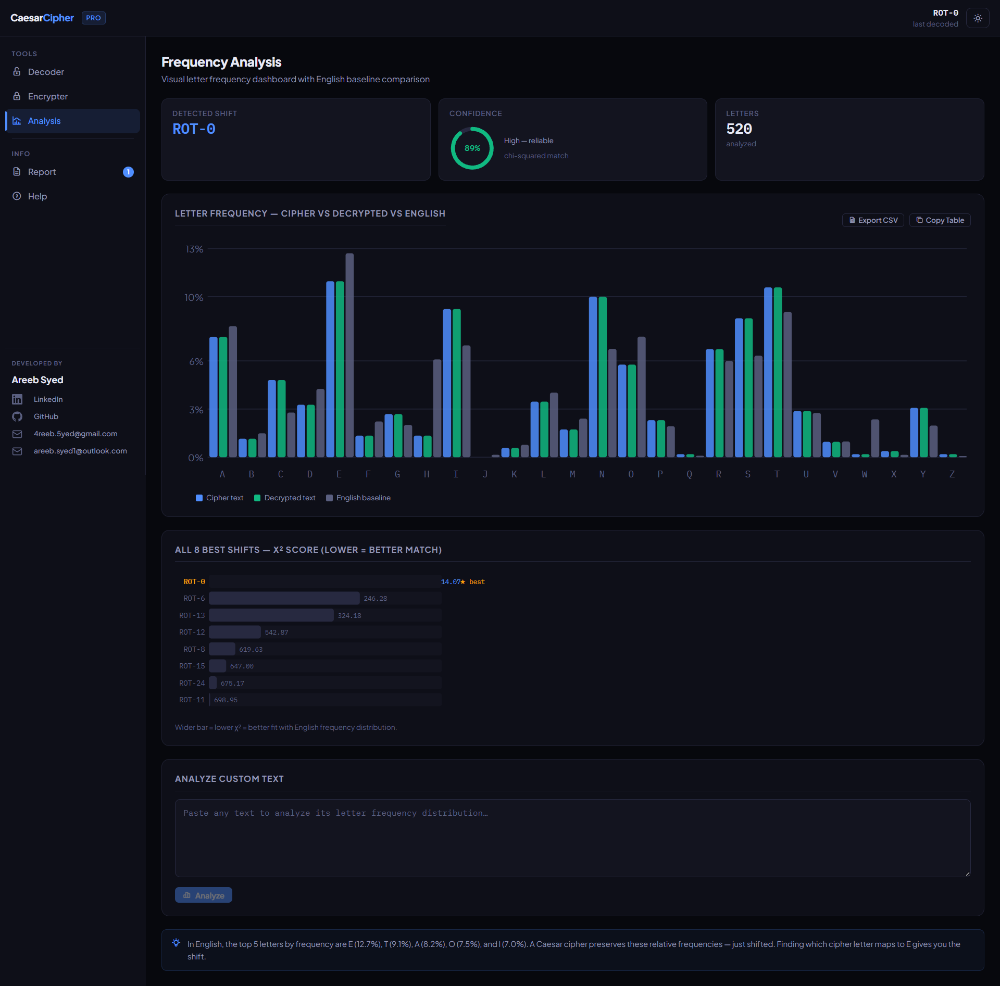
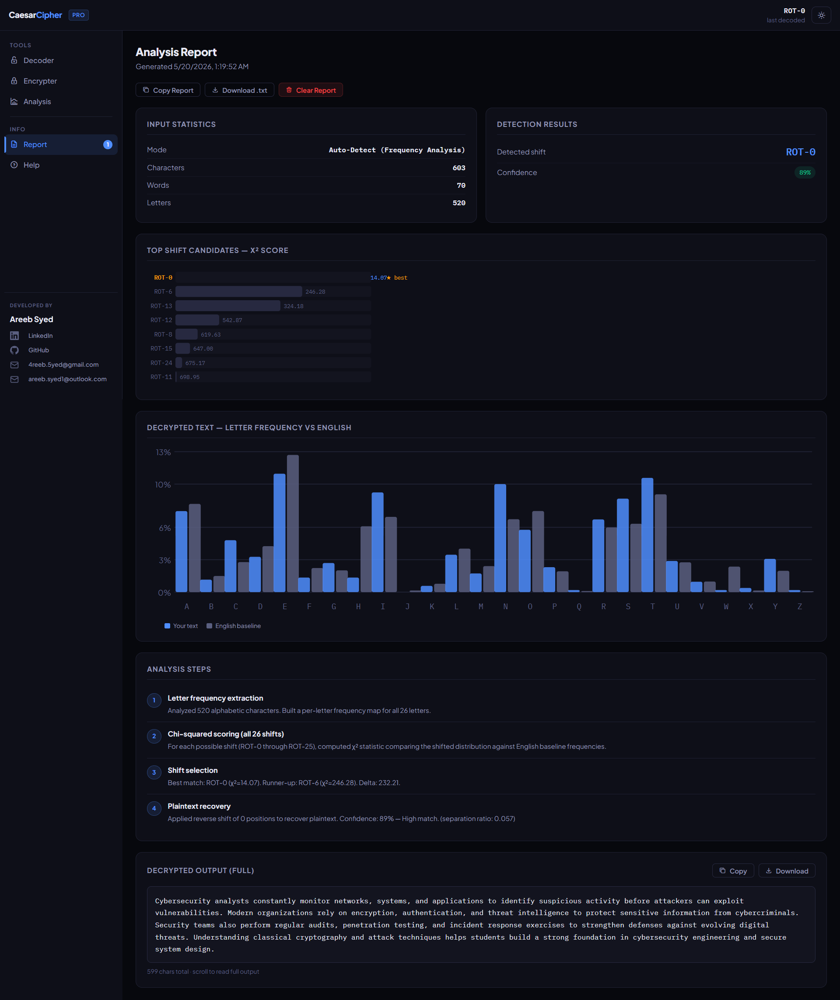
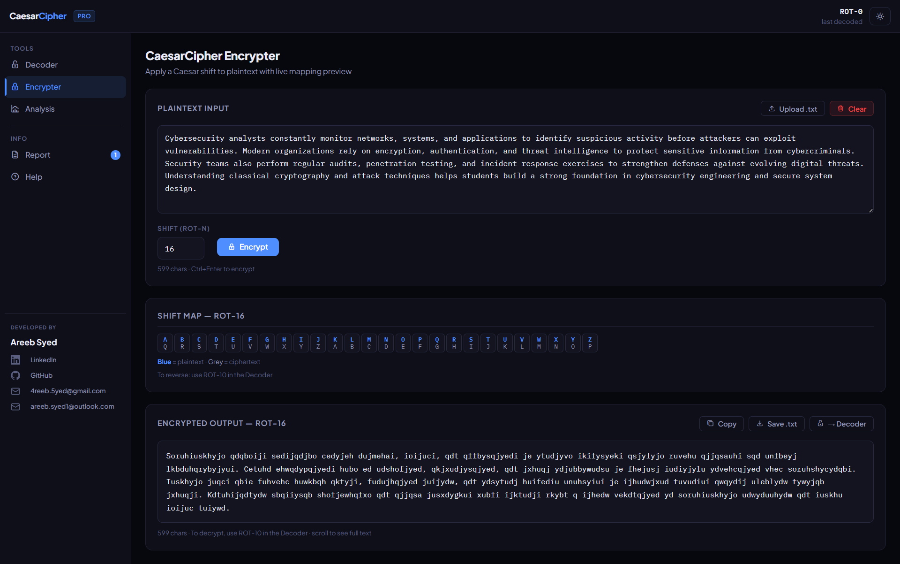
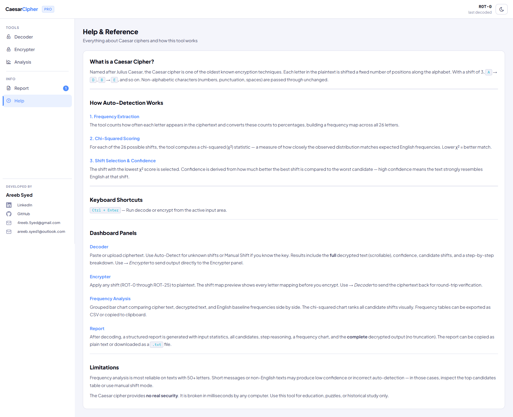

# Caesar Cipher Pro

Cryptographic analysis platform for automated Caesar cipher detection, statistical frequency analysis, and analytical reporting.

**Live Demo**  
https://caesar-cipher-pro.netlify.app/

---

## Interface

### Decoder Dashboard



### Frequency Analysis



### Report System



### Encryption Panel



### Help & Documentation



---

## Overview

Caesar Cipher Pro is a browser-based cryptanalysis environment engineered around automated shift detection using chi-squared (χ²) statistical analysis.

The platform evaluates all possible Caesar shifts, ranks candidates against English-language frequency baselines, and surfaces the most probable plaintext using calibrated confidence scoring.

The architecture isolates cryptographic computation, browser-side services, application state, and rendering systems into independently maintainable layers.

---

## Systems

### Cryptographic Engine
- automated shift inference
- chi-squared statistical analysis
- confidence-evaluation models
- frequency-distribution analysis

### Analysis Infrastructure
- grouped frequency visualization
- candidate ranking system
- analytical reporting workflows
- exportable report generation

### Application Architecture
- isolated cryptographic core
- hook-driven state management
- service abstraction layer
- modular component system

---

## Architecture

```txt
src/
├── engine/        # Cryptographic core
├── hooks/         # Stateful application logic
├── services/      # Browser abstractions
├── components/    # Reusable UI system
├── panels/        # Top-level application views
└── styles/        # Modular styling architecture
```

Detailed implementation documentation is available in `/docs`.

---

## Stack

```txt
React • Vite • JavaScript • Modular CSS
Node.js • Analytical Visualization • Netlify
```

---

## Local Development

```bash
git clone https://github.com/4reeb-5yed/caesar-cipher-tool.git

cd caesar-cipher-tool/caesar-cipher-tool

npm install
npm run dev
```

Production build:

```bash
npm run build
```

<<<<<<< HEAD
Output is written to `dist/`. The build is optimised by Vite's Rolldown bundler for minimal bundle size and fast loading.

### Preview Production Build Locally

```bash
npm run preview
```

---

## Usage

### Keyboard Shortcuts

| Shortcut | Action |
|---|---|
| `Ctrl + Enter` | Run decode or encrypt from the active input |

### Decoding a Ciphertext

1. Navigate to **Decoder** in the sidebar
2. Paste ciphertext into the input area (or drag-and-drop a `.txt` file)
3. Select **Auto-Detect** to let the engine find the shift, or **Manual Shift** if you know the key
4. Click **Decode** or press `Ctrl+Enter`
5. Review the decrypted output, confidence score, and top shift candidates

### Encrypting Plaintext

1. Navigate to **Encrypter**
2. Paste or type plaintext
3. Set the shift value (ROT-N)
4. Click **Encrypt** — the shift map and encrypted output update immediately
5. Use **→ Decoder** to send the ciphertext directly to the Decoder for round-trip verification

### Frequency Analysis

1. Decode a ciphertext first (or use **Analyze Custom Text** in the Analysis panel)
2. Navigate to **Analysis**
3. Review the grouped bar chart comparing cipher, decrypted, and English baseline frequencies
4. The χ² score chart ranks all 8 best shift candidates — wider bar = lower χ² = better English match

---

## Limitations

- Frequency analysis is most reliable on texts with **50+ letters**. Short inputs produce low confidence scores by design and should be verified manually using the top candidates table.
- The chi-squared engine is calibrated for **English language text** only. Non-English ciphertexts will produce low confidence scores regardless of shift.
- The Caesar cipher provides **no real cryptographic security**. It can be broken in milliseconds by any computer. This tool is intended for education, puzzles, and historical study only.

---

## License

MIT License — open source, free to use. See [LICENSE](./LICENSE) for full terms.

---

## Developer

**Areeb Syed** — Software Developer

[](https://github.com/4reeb-5yed)
[](https://www.linkedin.com/in/areeb-syed-b19491245)
[](mailto:4reeb.5yed@gmail.com)
=======
---
